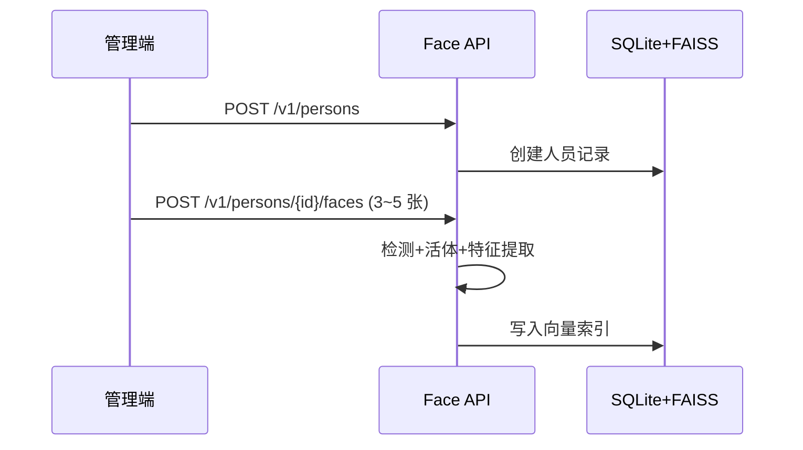
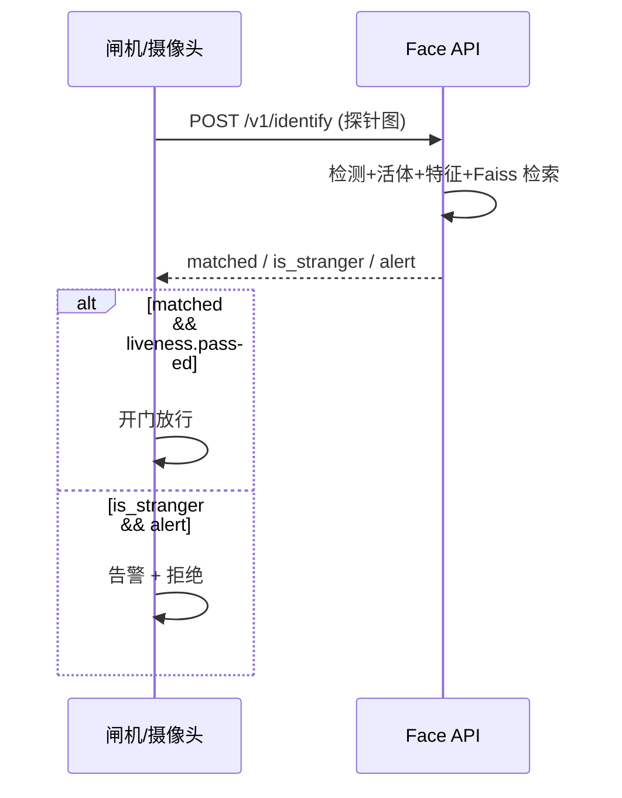
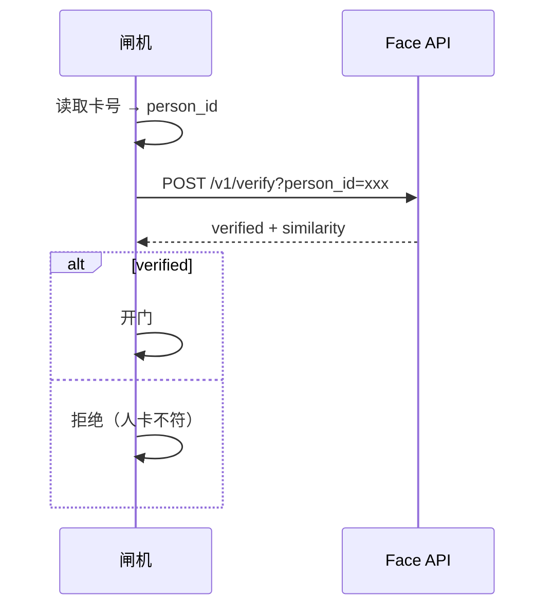

# Face Access Control API 接口文档

面向门禁/考勤场景的 **1:N 识别**、**1:1 验证**、**底库管理** 与 **事件审计** REST API。

| 项目 | 说明 |
| ---- | ---- |
| 默认地址 | `http://localhost:8123` |
| API 前缀 | `/v1` |
| 协议 | HTTP/1.1 |
| 数据格式 | JSON（上传图片为 `multipart/form-data`） |
| 交互式文档 | [Swagger UI](http://localhost:8123/docs) · [ReDoc](http://localhost:8123/redoc) |
| OpenAPI JSON | `http://localhost:8123/openapi.json` |

---

## 目录

1. [通用约定](#通用约定)
2. [鉴权](#鉴权)
3. [健康检查](#健康检查)
4. [人员管理](#人员管理)
5. [人脸注册](#人脸注册)
6. [1:N 识别](#1n-识别)
7. [1:1 验证](#11-验证)
8. [统计与审计](#统计与审计)
9. [错误码](#错误码)
10. [典型业务流程](#典型业务流程)

---

## 通用约定

### 请求头

| 请求头 | 必填 | 说明 |
| ------ | ---- | ---- |
| `Content-Type` | 视接口而定 | JSON 接口为 `application/json`；上传图片为 `multipart/form-data` |
| `X-API-Key` | 生产环境必填 | 当服务端配置了 `API_KEY` 环境变量时必传 |
| `X-Request-ID` | 否 | 客户端可传入追踪 ID；未传时服务端自动生成并在响应头回传 |

### 响应头

| 响应头 | 说明 |
| ------ | ---- |
| `X-Request-ID` | 本次请求的唯一标识，与响应体中的 `request_id` 一致（识别/注册/验证类接口） |

### 统一错误格式

HTTP 4xx/5xx 时，响应体为：

```json
{
  "error": {
    "code": "FACE_NOT_DETECTED",
    "message": "No face detected in image",
    "details": {}
  }
}
```

| 字段 | 类型 | 说明 |
| ---- | ---- | ---- |
| `error.code` | string | 机器可读错误码，见 [错误码](#错误码) |
| `error.message` | string | 人类可读说明 |
| `error.details` | object | 附加信息（如校验失败字段、注册上限 `current`/`max` 等） |

### 图片要求

- 支持格式：JPEG、PNG 等 OpenCV 可解码的常见格式
- 建议：正面人脸、光照均匀、分辨率 ≥ 640×480
- 单张图片仅处理 **一张人脸**（多人脸时按 `multi_face_policy` 取最大脸或拒绝，默认取最大）
- 质量门控：检测置信度 ≥ `MIN_DET_SCORE`（默认 0.5），人脸短边 ≥ `MIN_FACE_SIZE_PX`（默认 80px）

### 时间格式

所有 `datetime` 字段为 ISO 8601 UTC，例如：`2026-07-13T06:30:00.123456+00:00`。

---

## 鉴权

未设置 `API_KEY` 时，所有接口（除健康检查外）无需鉴权，适合本地开发。

生产环境在 `.env` 中设置：

```bash
API_KEY=your-production-secret
```

请求时携带：

```http
X-API-Key: your-production-secret
```

鉴权失败返回 **401**：

```json
{
  "error": {
    "code": "UNAUTHORIZED",
    "message": "Invalid or missing API key",
    "details": {}
  }
}
```

> `/v1/health` 与 `/v1/ready` **不需要** API Key，便于 K8s/Docker 探针。

### 运行环境（`ENVIRONMENT`）

| 值 | `skip_liveness` | 说明 |
| ---- | ---- | ---- |
| `development`（默认） | 允许 `skip_liveness=true` | 本地 / Docker 开发模式 |
| `production` | **禁止**；传 `skip_liveness=true` 返回 **403** | `COMPOSE_MODE=prod` 或 `.env` 中设置 |

生产部署请同时设置 `API_KEY`，详见 [README 生产配置](../README.md#生产配置)。

---

## 健康检查

### GET `/v1/health`

存活探针，不鉴权。用于确认进程已启动、模型已加载、底库可访问。

**响应 200**

```json
{
  "status": "ok",
  "version": "1.0.0",
  "device": "cuda:0",
  "gallery_size": 15,
  "person_count": 3,
  "liveness_enabled": true,
  "liveness_models_loaded": true
}
```

| 字段 | 类型 | 说明 |
| ---- | ---- | ---- |
| `status` | string | 固定 `"ok"` |
| `version` | string | 服务版本 |
| `device` | string | 推理设备，如 `cuda:0`、`cpu` |
| `gallery_size` | int | 底库中已注册人脸模板总数 |
| `person_count` | int | 人员数量 |
| `liveness_enabled` | bool | 是否启用活体检测 |
| `liveness_models_loaded` | bool | 活体 ONNX 模型是否加载成功 |

---

### GET `/v1/ready`

就绪探针，不鉴权。用于确认服务可接受业务流量（引擎、底库、活体模型均就绪）。

**响应 200**

```json
{
  "ready": true,
  "checks": {
    "engine": true,
    "gallery": true,
    "liveness_models": true
  }
}
```

| 字段 | 说明 |
| ---- | ---- |
| `ready` | 所有 `checks` 均为 `true` 时为 `true` |
| `checks.engine` | 人脸分析引擎已初始化 |
| `checks.gallery` | 底库存储已初始化 |
| `checks.liveness_models` | 活体模型可用（未启用活体时为 `true`） |

---

## 人员管理

所有 `/v1/persons` 接口需要 API Key（若已配置）。

### POST `/v1/persons`

创建人员记录（不含人脸，需后续注册照片）。

**请求体** `application/json`

```json
{
  "person_id": "emp001",
  "display_name": "张三",
  "metadata": {
    "dept": "研发",
    "card_no": "A10086"
  }
}
```

| 字段 | 类型 | 必填 | 约束 |
| ---- | ---- | ---- | ---- |
| `person_id` | string | 是 | 1~128 字符，仅 `a-zA-Z0-9_-` |
| `display_name` | string | 是 | 1~256 字符 |
| `metadata` | object | 否 | 任意 JSON 对象，业务自定义字段 |

**响应 201**

```json
{
  "person_id": "emp001",
  "display_name": "张三",
  "metadata": {"dept": "研发", "card_no": "A10086"},
  "face_count": 0,
  "created_at": "2026-07-13T06:00:00+00:00",
  "updated_at": "2026-07-13T06:00:00+00:00"
}
```

**常见错误**

| HTTP | code | 场景 |
| ---- | ---- | ---- |
| 400 | `INVALID_REQUEST` | `person_id` 格式非法或已存在 |

---

### GET `/v1/persons`

分页列出所有人员。

**查询参数**

| 参数 | 类型 | 默认 | 说明 |
| ---- | ---- | ---- | ---- |
| `offset` | int | `0` | 跳过条数，≥ 0 |
| `limit` | int | `100` | 每页条数，1~500 |

**响应 200**

```json
{
  "total": 2,
  "items": [
    {
      "person_id": "emp001",
      "display_name": "张三",
      "metadata": {},
      "face_count": 3,
      "created_at": "...",
      "updated_at": "..."
    }
  ]
}
```

---

### GET `/v1/persons/{person_id}`

查询单个人员详情。

**路径参数**

| 参数 | 说明 |
| ---- | ---- |
| `person_id` | 人员 ID |

**响应 200**：同 `PersonResponse` 结构。

**常见错误**

| HTTP | code | 场景 |
| ---- | ---- | ---- |
| 404 | `PERSON_NOT_FOUND` | 人员不存在 |

---

### DELETE `/v1/persons/{person_id}`

删除人员及其底库中所有人脸模板（SQLite + FAISS 同步删除）。

**响应 204**：无响应体。

**常见错误**

| HTTP | code | 场景 |
| ---- | ---- | ---- |
| 404 | `PERSON_NOT_FOUND` | 人员不存在 |

---

## 人脸注册

### POST `/v1/persons/{person_id}/faces`

为指定人员注册一张或多张人脸照片，提取 512 维特征向量写入底库。

**Content-Type**：`multipart/form-data`

**表单字段**

| 字段 | 类型 | 必填 | 说明 |
| ---- | ---- | ---- | ---- |
| `images` | file[] | 是 | 一张或多张人脸照片（字段名固定为 `images`，可重复） |

**查询参数**

| 参数 | 类型 | 默认 | 说明 |
| ---- | ---- | ---- | ---- |
| `skip_liveness` | bool | `false` | `true` 时跳过活体；**仅 `ENVIRONMENT=development` 有效**，生产环境返回 403 |

**处理流程**

1. 检查人员是否存在
2. 检查 `当前 face_count + 本次上传数 ≤ MAX_FACES_PER_PERSON`（默认 5）
3. 逐张图片：人脸检测 → 质量门控 → 活体检测（可跳过）→ 特征提取 → 写入底库

**响应 200**

```json
{
  "request_id": "a1b2c3d4-...",
  "person_id": "emp001",
  "enrolled": [
    {
      "face_id": "f8e7d6c5-...",
      "person_id": "emp001",
      "created_at": "2026-07-13T06:05:00+00:00",
      "quality": {
        "det_score": 0.92,
        "bbox": [120.5, 80.3, 280.1, 310.7],
        "face_width_px": 159.6,
        "face_height_px": 230.4
      },
      "liveness": {
        "passed": true,
        "score": 0.87,
        "method": "rgb_passive_minifasnet",
        "model_scores": {
          "MiniFASNetV1SE": 0.85,
          "MiniFASNetV2": 0.89
        }
      }
    }
  ],
  "total_faces": 3
}
```

| 字段 | 说明 |
| ---- | ---- |
| `enrolled` | 本次成功注册的人脸列表 |
| `total_faces` | 该人员注册后的总人脸数 |
| `quality.bbox` | `[x1, y1, x2, y2]` 像素坐标 |
| `liveness` | 未启用活体时为 `null` |

**curl 示例**

```bash
curl -X POST "http://localhost:8123/v1/persons/emp001/faces" \
  -H "X-API-Key: your-secret" \
  -F "images=@photo1.jpg" \
  -F "images=@photo2.jpg" \
  -F "images=@photo3.jpg"
```

**常见错误**

| HTTP | code | 场景 |
| ---- | ---- | ---- |
| 404 | `PERSON_NOT_FOUND` | 人员不存在 |
| 400 | `ENROLLMENT_LIMIT` | 超过每人最大注册张数，`details` 含 `current`/`requested`/`max` |
| 400 | `FACE_NOT_DETECTED` | 图片中未检测到人脸 |
| 400 | `LOW_FACE_QUALITY` | 检测置信度或人脸尺寸不达标 |
| 400 | `LIVENESS_FAILED` | 活体检测未通过 |
| 403 | `INVALID_REQUEST` | `ENVIRONMENT=production` 时请求了 `skip_liveness=true` |
| 400 | `MULTIPLE_FACES` | 检测到多张人脸且策略为 `reject` |

**重复注册说明**

- 同一 `person_id` 多次上传：**累加**新模板，不覆盖旧模板
- 1:N 检索时，同一人员多张模板取 **最高相似度** 作为该人得分

---

### DELETE `/v1/persons/{person_id}/faces/{face_id}`

删除指定人员的单张人脸模板。

**响应 204**：无响应体。

**常见错误**

| HTTP | code | 场景 |
| ---- | ---- | ---- |
| 404 | `FACE_NOT_FOUND` | 人脸 ID 不存在或不属于该人员 |

---

## 1:N 识别

闸机/摄像头探针场景：上传一张照片，在底库中搜索最相似的人员。

### POST `/v1/identify`

**Content-Type**：`multipart/form-data`

**表单字段**

| 字段 | 类型 | 必填 | 说明 |
| ---- | ---- | ---- | ---- |
| `image` | file | 是 | 探针人脸照片 |

**查询参数**

| 参数 | 类型 | 默认 | 说明 |
| ---- | ---- | ---- | ---- |
| `skip_liveness` | bool | `false` | 跳过活体；**仅开发环境**（`ENVIRONMENT=development`）有效 |

**响应 200**

```json
{
  "request_id": "a1b2c3d4-...",
  "matched": true,
  "person_id": "emp001",
  "display_name": "张三",
  "similarity": 0.68,
  "threshold": 0.42,
  "is_stranger": false,
  "alert": false,
  "candidates": [
    {
      "rank": 1,
      "person_id": "emp001",
      "display_name": "张三",
      "similarity": 0.68,
      "matched": true
    },
    {
      "rank": 2,
      "person_id": "emp002",
      "display_name": "李四",
      "similarity": 0.31,
      "matched": false
    }
  ],
  "quality": {
    "det_score": 0.91,
    "bbox": [100.0, 60.0, 260.0, 290.0],
    "face_width_px": 160.0,
    "face_height_px": 230.0
  },
  "liveness": {
    "passed": true,
    "score": 0.87,
    "method": "rgb_passive_minifasnet",
    "model_scores": {}
  },
  "latency_ms": {
    "inference": 45.2,
    "search": 0.8,
    "total": 46.0
  }
}
```

**核心字段语义**

| 字段 | 说明 |
| ---- | ---- |
| `matched` | 最高相似度是否 ≥ `IDENTIFY_THRESHOLD`（默认 0.42） |
| `similarity` | 最佳匹配的余弦相似度（L2 归一化内积） |
| `threshold` | 当前生效的 1:N 识别阈值 |
| `is_stranger` | 检测到人脸，但底库无超过阈值的匹配 → **陌生人** |
| `alert` | `STRANGER_ALERT_ENABLED=true` 且 `is_stranger=true` 时为 `true`，供业务触发闯入告警 |
| `candidates` | Top-K 候选列表（K = `IDENTIFY_TOP_K`，默认 5），按相似度降序 |
| `candidates[].matched` | 该候选人相似度是否超过阈值 |
| `latency_ms` | 各阶段耗时（毫秒） |

**业务判断建议**

```
if (!response.liveness?.passed)     → 拒绝通行（假体攻击）
if (response.matched)               → 放行，person_id = response.person_id
if (response.is_stranger && response.alert) → 触发闯入告警
```

**curl 示例**

```bash
curl -X POST "http://localhost:8123/v1/identify" \
  -H "X-API-Key: your-secret" \
  -F "image=@probe.jpg"
```

**常见错误**

| HTTP | code | 场景 |
| ---- | ---- | ---- |
| 503 | `GALLERY_EMPTY` | 底库为空，需先注册人员 |
| 400 | `FACE_NOT_DETECTED` | 未检测到人脸 |
| 400 | `LIVENESS_FAILED` | 活体未通过 |
| 400 | `LOW_FACE_QUALITY` | 质量不达标 |
| 403 | `INVALID_REQUEST` | 生产环境请求了 `skip_liveness=true` |

> 识别成功但无匹配时 **不报错**，返回 200 且 `matched=false`、`is_stranger=true`。

---

## 1:1 验证

已知身份场景（刷卡/扫码后已有 `person_id`）：确认来人是否为该身份。

### POST `/v1/verify`

**Content-Type**：`multipart/form-data`

**查询参数**

| 参数 | 类型 | 必填 | 说明 |
| ---- | ---- | ---- | ---- |
| `person_id` | string | 是 | 待验证的人员 ID |
| `skip_liveness` | bool | 否 | 跳过活体；**仅开发环境**有效，生产返回 403 |

**表单字段**

| 字段 | 类型 | 必填 | 说明 |
| ---- | ---- | ---- | ---- |
| `image` | file | 是 | 探针人脸照片 |

**响应 200**

```json
{
  "request_id": "a1b2c3d4-...",
  "verified": true,
  "person_id": "emp001",
  "display_name": "张三",
  "similarity": 0.72,
  "threshold": 0.42,
  "matched_face_id": "f8e7d6c5-...",
  "quality": { "...": "..." },
  "liveness": { "...": "..." },
  "latency_ms": {
    "inference": 42.1,
    "verify": 0.3,
    "total": 42.4
  }
}
```

| 字段 | 说明 |
| ---- | ---- |
| `verified` | 探针与指定人员所有注册模板的最高相似度 ≥ `VERIFY_THRESHOLD` |
| `similarity` | 最高相似度 |
| `threshold` | 当前 1:1 验证阈值（可与 1:N 阈值独立配置） |
| `matched_face_id` | 匹配度最高的那张注册模板的 `face_id` |

**curl 示例**

```bash
curl -X POST "http://localhost:8123/v1/verify?person_id=emp001" \
  -H "X-API-Key: your-secret" \
  -F "image=@probe.jpg"
```

**常见错误**

| HTTP | code | 场景 |
| ---- | ---- | ---- |
| 404 | `PERSON_NOT_FOUND` | 人员不存在 |
| 400 | `NO_ENROLLED_FACES` | 人员存在但未注册人脸 |
| 400 | `FACE_NOT_DETECTED` / `LIVENESS_FAILED` / `LOW_FACE_QUALITY` | 同识别接口 |
| 403 | `INVALID_REQUEST` | 生产环境请求了 `skip_liveness=true` |

> 验证失败（相似度不足）时返回 200 且 `verified=false`，不抛 `NO_MATCH`。

---

## 统计与审计

识别与验证事件自动写入 `{DATA_DIR}/events.db`（默认 `./data/events.db`，需 `EVENT_LOG_ENABLED=true`）。

### GET `/v1/stats`

底库规模 + 事件汇总统计。

**查询参数**

| 参数 | 类型 | 默认 | 说明 |
| ---- | ---- | ---- | ---- |
| `days` | int | `7` | 统计窗口天数，1~365 |

**响应 200**

```json
{
  "period_days": 7,
  "gallery": {
    "person_count": 10,
    "face_count": 35
  },
  "events": {
    "total_events": 1200,
    "identify_count": 1000,
    "verify_count": 200,
    "matched_count": 850,
    "stranger_count": 120,
    "pass_rate": 0.85,
    "daily": [
      {"date": "2026-07-07", "total": 150, "matched": 130, "strangers": 15, "verify_pass": 20}
    ],
    "top_persons": [
      {
        "person_id": "emp001",
        "display_name": "张三",
        "event_count": 45,
        "last_seen_at": "2026-07-13T05:30:00+00:00"
      }
    ]
  }
}
```

| 字段 | 说明 |
| ---- | ---- |
| `events.pass_rate` | 识别事件中 `matched=true` 的比例 |
| `events.daily` | 按日聚合的识别/验证量 |
| `events.top_persons` | 窗口内识别次数最多的人员 |

---

### GET `/v1/events`

识别/验证事件历史，支持分页与筛选。

**查询参数**

| 参数 | 类型 | 默认 | 说明 |
| ---- | ---- | ---- | ---- |
| `offset` | int | `0` | 分页偏移 |
| `limit` | int | `50` | 每页条数，1~500 |
| `event_type` | string | — | `identify` 或 `verify` |
| `person_id` | string | — | 按匹配人员筛选 |
| `is_stranger` | bool | — | `true` 仅陌生人（闯入）事件 |

**响应 200**

```json
{
  "total": 1200,
  "items": [
    {
      "event_id": "evt-uuid-...",
      "request_id": "req-uuid-...",
      "event_type": "identify",
      "created_at": "2026-07-13T06:10:00+00:00",
      "matched": false,
      "is_stranger": true,
      "person_id": null,
      "display_name": null,
      "similarity": 0.28,
      "threshold": 0.42,
      "liveness_passed": true,
      "latency_ms": 46.0,
      "metadata": {}
    }
  ]
}
```

**curl 示例**

```bash
# 近 7 日统计
curl -s "http://localhost:8123/v1/stats?days=7" -H "X-API-Key: your-secret"

# 陌生人事件
curl -s "http://localhost:8123/v1/events?is_stranger=true&limit=20" -H "X-API-Key: your-secret"

# 某人的识别记录
curl -s "http://localhost:8123/v1/events?person_id=emp001&event_type=identify" -H "X-API-Key: your-secret"
```

**常见错误**

| HTTP | code | 场景 |
| ---- | ---- | ---- |
| 503 | `EVENT_LOG_DISABLED` | `EVENT_LOG_ENABLED=false` 时不可用 |

---

## 错误码

| code | HTTP | 含义 |
| ---- | ---- | ---- |
| `INVALID_REQUEST` | 400 / 403 / 422 | 请求参数非法、JSON 校验失败、图片无法解码；**403** 含生产环境禁止 `skip_liveness` |
| `UNAUTHORIZED` | 401 | API Key 缺失或错误 |
| `FACE_NOT_DETECTED` | 400 | 图片中未检测到人脸 |
| `MULTIPLE_FACES` | 400 | 检测到多张人脸且策略为拒绝 |
| `LOW_FACE_QUALITY` | 400 | 检测置信度或人脸尺寸不达标 |
| `LIVENESS_FAILED` | 400 | 被动活体检测未通过 |
| `LIVENESS_UNAVAILABLE` | 503 | 活体已启用但模型未加载 |
| `PERSON_NOT_FOUND` | 404 | 人员不存在 |
| `FACE_NOT_FOUND` | 404 | 人脸模板不存在 |
| `GALLERY_EMPTY` | 503 | 底库为空，无法执行 1:N 识别 |
| `NO_MATCH` | — | 保留码；识别接口以 `matched=false` 表达无匹配 |
| `NO_ENROLLED_FACES` | 400 | 1:1 验证时人员未注册人脸 |
| `ENROLLMENT_LIMIT` | 400 | 超过每人最大注册张数 |
| `EVENT_LOG_DISABLED` | 503 | 事件日志功能已关闭 |
| `INTERNAL_ERROR` | 500 | 服务端未捕获异常 |

---

## 典型业务流程

### 门禁底库初始化



### 闸机 1:N 通行



### 刷卡后 1:1 核验



---

## 相关配置

与接口行为直接相关的环境变量（完整列表见 [README](../README.md)）。Docker Compose 通过 `env_file: .env` 注入；路径使用相对形式 `./models/...`、`./data`。

| 变量 | 默认 | 影响接口 |
| ---- | ---- | -------- |
| `ENVIRONMENT` | `development` | `production` 时禁止 `skip_liveness`（403） |
| `API_KEY` | 空 | 设置后除 `/health`、`/ready` 外均需 `X-API-Key` |
| `PORT` | `8123` | 服务监听端口 |
| `DET_MODEL_DIR` / `RECOG_MODEL_DIR` | `./models/...` | 模型加载路径（与挂载一致） |
| `RECOG_MODEL_NAME` | `glint360k_r100.onnx` | 识别模型；换模型须重建底库 |
| `DATA_DIR` | `./data` | 底库 `gallery.db`、事件 `events.db` 目录 |
| `IDENTIFY_THRESHOLD` | `0.42` | `/v1/identify` 的 `threshold` 与 `matched` 判定 |
| `VERIFY_THRESHOLD` | `0.42` | `/v1/verify` 的 `threshold` 与 `verified` 判定 |
| `IDENTIFY_TOP_K` | `5` | `/v1/identify` 的 `candidates` 数量 |
| `MAX_FACES_PER_PERSON` | `5` | 注册上限 |
| `STRANGER_ALERT_ENABLED` | `true` | `/v1/identify` 的 `alert` 字段 |
| `LIVENESS_ON_ENROLL` | `true` | 注册时是否强制活体 |
| `LIVENESS_ON_IDENTIFY` | `true` | 识别时是否强制活体 |
| `LIVENESS_ON_VERIFY` | `true` | 验证时是否强制活体 |
| `EVENT_LOG_ENABLED` | `true` | `/v1/events`、`/v1/stats` 是否可用 |

---

## 版本

文档对应服务版本：**1.0.0**。如有字段变更，以 `http://localhost:8123/openapi.json` 为准。
